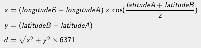

# [Defibrillators](https://www.codingame.com/training/puzzle/defibrillators)

    

        <h3>
            Progress
        </h3>
        
        

            100%
        

    

    

        <h3>
            Achievements
        </h3>
        
        

            2/2
        

    

## WHAT WILL I LEARN?
### [Loops](https://www.codingame.com/learn/loops), [Distances](https://www.codingame.com/learn/distance), [Trigonometry](https://www.codingame.com/learn/trigonometry)
This puzzle makes you split a string into substrings, replace a character of a string and convert it into floats. You also have to convert degrees into radians and use mathematical operations like square root or cosinus.

Finally you have to apply multiple computations (addition, multiplication...) on floating numbers.

External resources: [Strings](https://en.wikipedia.org/wiki/String_(computer_science)), [Degrees to radians](https://en.wikipedia.org/wiki/Radian#Conversion_between_radians_and_degrees), [Harvesine Formula](https://en.wikipedia.org/wiki/Radian#Conversion_between_radians_and_degrees)

### STATEMENT
The goal of this exercise is to make you find the closest point to given geographic coordinates (latitude and longitude). Your program must print the associated location name.

In this puzzle you will play a lot with conversion (degree to radian, coordinates to distance, string to float).

### STORY
Want to save lives? Good! So help us find the closest defibrillator from a given position in the city of Montpellier, France.

## The Goal
The city of Montpellier has equipped its streets with defibrillators to help save victims of cardiac arrests. The data corresponding to the position of all defibrillators is available online.

Based on the data we provide in the tests, write a program that will allow users to find the defibrillator nearest to their location using their mobile phone.
##Rules
The input data you require for your program is provided in text format.
This data is comprised of lines, each of which represents a defibrillator. Each defibrillator is represented by the following fields:
* A number identifying the defibrillator  
* Name  
* Address  
* Contact Phone number  
* Longitude (degrees)  
* Latitude (degrees)  
* These fields are separated by a semicolon (;).  

_Beware: the decimal numbers use the comma (,) as decimal separator. Remember to turn the comma (,) into dot (.) if necessary in order to use the data in your program._

### DISTANCE
The distance d between two points A and B will be calculated using the following formula:

_Note: In this formula, the latitudes and longitudes are expressed in radians. 6371 corresponds to the radius of the earth in km._

The program will display the name of the defibrillator located the closest to the user’s position. This position is given as input to the program.

## Game Input
### Input
Line 1: Number N of horses

The N following lines: the strength Pi of each horse. Pi is an integer.

### Output
The difference D between the two closest strengths. D is an integer greater than or equal to 0.
Constraints
1 < N  < 100000
0 < Pi ≤ 10000000

### Example
#### Input
> 3,879483  
> 43,608177  
> 3  
> 1;Maison de la Prevention Sante;6 rue Maguelone 340000 Montpellier;;3,87952263361082;43,6071285339217  
> 2;Hotel de Ville;1 place Georges Freche 34267 Montpellier;;3,89652239197876;43,5987299452849  
> 3;Zoo de Lunaret;50 avenue Agropolis 34090 Mtp;;3,87388031141133;43,6395872778854  

#### Output
> Maison de la Prevention Sante  

##[Solve It!](https://www.codingame.com/ide/puzzle/defibrillators)